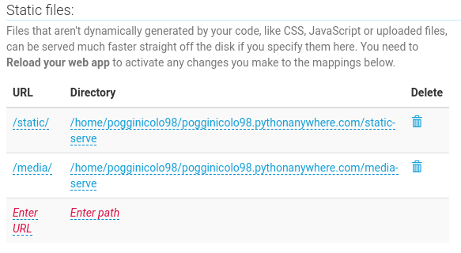

# Agorà forum

Project to practice with Django and Bootstrap frameworks.
This web app is a forum site with the following main features:
1) Forum layout: sections, discussions and posts
2) User registration and authentication
3) Pagination of contents
4) Search bar
5) 100% responsive

The site is organized into macro threads called "sections". Staff users can create and delete sections.
For each section, users can start new thread or join existing ones. Each user can delete their own posts.
Through the search bar you can search for keywords in discussions, posts and users data.
Users can register or log in if they have previously registered. There is a password reset system with identity verification via email.

#### Live demo: [Agorà forum](http://pogginicolo98.pythonanywhere.com/)

#### Udemy course: [Guida Pratica e Completa a Django, Python e Bootstrap](https://www.udemy.com/course/guida-pratica-e-completa-a-django-2-e-bootstrap-4/)

## Frameworks and technologies used:
#### Frameworks
- [Django](https://docs.djangoproject.com/en/3.2/) - back-end
- [Bootstrap](https://getbootstrap.com/docs/4.6/getting-started/introduction/) - front-end

#### Databases
- [SQLite](https://sqlite.org/docs.html) - Storage and web-app structure

## Setup for production on pythonanywhere.com
#### Clone the repository and configure the virtual environment:
```
$ pip3.9 install --user pythonanywhere
$ pa_autoconfigure_django.py --python=3.9 https://github.com/pogginicolo98/agora-forum.git --branch=master
$ source .virtualenvs/pogginicolo98.pythonanywhere.com/bin/activate
$ pip install pillow
$ pip install django-crispy-forms
```

#### Setup and test django project:
First of all populate ```USER.pythonanywhere.com/setup/password_empty.py``` with your keys.
```
(USER.pythonanywhere.com) USER.pythonanywhere.com$ mv setup/password_empty.py social_site/password.py
(USER.pythonanywhere.com) USER.pythonanywhere.com$ python manage.py makemigrations
(USER.pythonanywhere.com) USER.pythonanywhere.com$ python manage.py migrate
(USER.pythonanywhere.com) USER.pythonanywhere.com$ python manage.py test
(USER.pythonanywhere.com) USER.pythonanywhere.com$ python manage.py collectstatic
```
#### Edit the static files directories on pythonanywhere web tab as folowing:


Reload the Web app so it should work properly.
